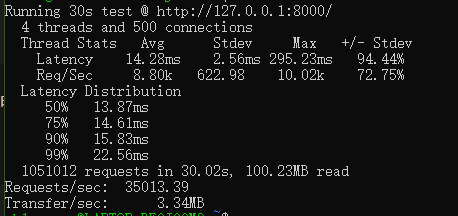
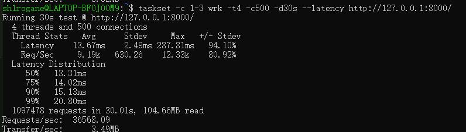
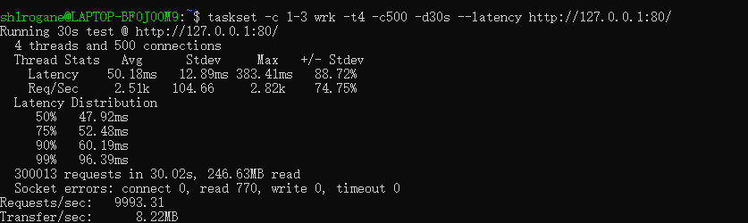

# 优化日志 ： 系统调用瓶颈， 272%的QPS跃迁


## 背景

在完成单线程模型架构后，我添加了简单的http解析，欲使用wrk进行压力测试。
本地脚本短连接回声数据在50-60k左右波动，
预计单核QPS应在75-100k左右。

## 问题

wrk的结果显示，单线程QPS在35k左右，远低于预期，且延迟极高。



## 分析排查

35kQPS，说明Reactor模型存在严重问题，或者出现阻塞
高延迟的情况下，Stdev数据为2.56ms，波动不是太大，说明延迟卡顿时持续稳定的

为了排查瓶颈，我使用**控制变量法**进行定位：

- *日志阻塞*：注释所有cout，仅保留检查错误日志。测试后性能几乎无差异
- *Nagle算法*：开启`TCP_NODELAY`选项，测试后延迟几乎无差异
- *编译优化*：确认使用`-O2`编译

- **分析TcpConnection代码**：发现send接口需要多次内存拷贝，每次都要将buffer数据拷贝到一个string对象：
    ```cpp
    // 一次堆分配 + 一次栈拷贝
    std::string msg = buf->retrieveAllAsString(); 

    // 参数传递拷贝
    conn->send(msg);

    // ::write 系统调用 
    ::write(fd, msg.data(), ...);
    ```

> 代价：一次堆分配 + 两次用户态拷贝 + 一次内核态拷贝

## 优化

    ```cpp
    // 新增重载函数，直接获取 Buffer 内部数据的指针
    // 无string 对象生成
    conn->send(buf->peek(), buf->readableBytes()); 

    // TcpConnection::send 直接拿指针传给 ::write
    ::write(fd, data, len);
    ```

> 优化后代价: 一次内核态拷贝

## 结果



> 很奇怪的是，QPS 36k， 延迟13ms，实现应用层零拷贝后，竟与优化前几乎无差别。
> 或许这说明用户态的拷贝代价并非限制性能的主要瓶颈。
> 现需要考虑**内核态**或者**系统环境**的影响。

## 进一步分析

### 1. 引入对照

代码层面的优化（零拷贝、NODELAY）均未生效，这迫使我将怀疑的目光投向了**操作系统本身**。
为了验证这一猜想，我引入了业界高性能 Web 服务器标杆——**Nginx** 作为对照组。

在相同环境下安装并启动 Nginx，进行同样的压测：
    ```bash
    taskset -c 1-3 wrk -t4 -c500 -d30s http://127.0.0.1:80/
    ```

- 分析Nginx在当前环境的性能数据



- 内容：Nginx在当前环境的QPS为10k，延迟在50ms左右.

> 作为业界标杆的 `Nginx` 在同环境下仅能达到 *10k QPS*，且延迟高达 *50ms*。显然证明性能瓶颈并非源自应用层代码逻辑，而是源自操作系统内核层面的系统调用开销。


### 2. 锁定原因

- 经查阅资料，了解到当前环境为WSL1
- 技术瓶颈：
- - WSL1 是翻译层
- - Linux 的 `epoll/read/write` 需要翻译成 `Windows NT API`
- - 高并发io环境下，每秒数万次Syscall，翻译开销极其庞大，CPU 算力被消耗在“翻译”而非“数据搬运”上，所以出现了极差的数据，甚至低于我的单线程模型。


### 3. 最终优化

- 升级更新到WSL2。
- 再次进行同指令压测


### 4. 数据对比

| 核心指标 | WSL 1 (Old) | WSL 2 (New) | 提升幅度 |
| :--- | :--- | :--- | :--- |
| **QPS** | 35k | **95k** |  **+172%** |
| **Avg Latency** | 13.67ms | **5.23ms** |  **-61%** |
| **Stdev** | 2.56ms | **0.53ms** |  **-79%** |     


## 结论

> 本次性能跃迁在于识别且消除了系统调用翻译层的开销，优化后的 QPS 跃迁 172%，延迟下降 61%，Stdev 下降 79%。
> 虽然代码层面的零拷贝优化在 WSL1 下被系统消耗掩盖，但在 WSL2 的原生内核下，终于达到了单线程的数据指标（接近 100k QPS）。
