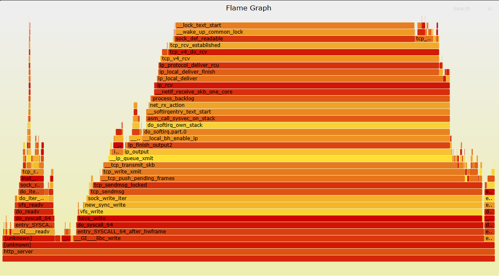
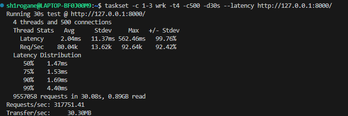
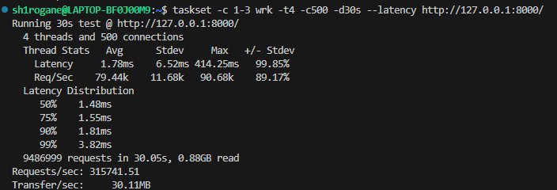
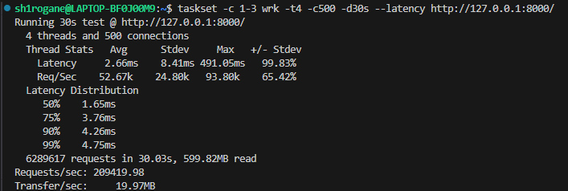
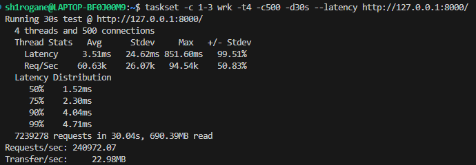
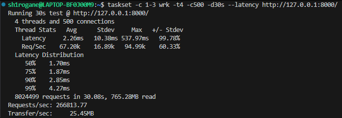
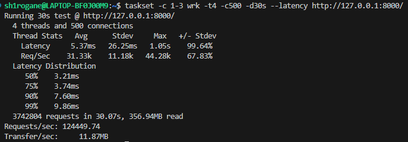
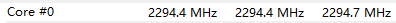

# 性能优化日志 002：91k 至 317k 的波动分析

## 背景

在上次对环境限制分析中，我意识到单凭wrk的数据无法明确性能瓶颈。
随后，我引入了perf和FlameGraph工具，对数据进行补充：

> 火焰图分析说明用户态零拷贝优化非常成功,用户态几乎没有消耗.

**但是,在采样期间,我分别在不同时段进行了多次性能测试,观察到反直觉现象:**

- 在代码未更改的情况下,QPS呈现极大的性能波动。
  - **数据峰值**: 317,751 QPS
  - **中间态**: 160k - 260k QPS不等
  - **低谷**: 95258 QPS

## 实验测试

为了解释这一非线性波动，我引入了HWMonitor观测数据，排除了软件因素，把观测点集中到了硬件层面。

### 冷机状态

- **变量控制**：在冷机状态下，控制压测时间为30s，进行三次实验，并在压测过程中观察 HWM 变化。
- 
- 

> 单核频率稳定在4.2GHz - 4.4GHz，数据稳定在300k+ QPS。

### 热机状态

- **变量控制**: 均衡状态下，控制压测时间为180s，进行三次实验，并在压测过程中观察 HWM 变化。
- 
- 
- 
- 
  
> 单核频率出现下降，最低频率降至 3.2GHz，数据在170k - 260k QPS之间波动，均值约为220k QPS。

### 强制节能

- **变量控制**: 在节能状态下，控制压测时间为30s，进行三次实验，并在压测过程中观察 HWM 变化。
- 
- 

> 节能模式下，单核频率降至 2.3GHz，数据在100k - 140k QPS之间波动，均值约为120k QPS。

> ***另外，观察到短时压测数据偏低，以及在系统刚唤醒或后台活跃时，QPS出现极低值***

## 分析

通过实验数据以及资料查询，得出了以下结论：

### 热节流效应

  - **冷机状态**：CPU 温度低，单核主频稳定在 4.2GHz - 4.4GHz。此时代码全速运行，达到 **300k+ QPS**。
  - **热机状态**：随着压测持续（60s+），设备散热触及瓶颈。BIOS 强制降低 CPU 电压与频率以保护硬件，导致 QPS 下降以及波动。
  - **节能状态**：由于节能模式下，CPU 频率降低，导致 QPS 大幅下降。
  
### 操作系统与缓存污染

这是导致切换 WSL 2 初次压测 95k 与节能模式下 140k 倒挂的原因。

- **140k (节能模式)**：主频虽被锁死在 **2.3 GHz**，但因 CPU 被压测进程**独占**，Cache 命中率极高，表现稳健。
- **95k (受干扰模式)**：在系统刚唤醒或后台（Windows Update等）活跃时，宿主机调度器频繁抢占物理核心。
  - **后果**：频繁的 **上下文切换** 导致 CPU Cache被其他进程“洗刷”，Server 线程每次恢复运行都需要从内存重新加载数据，造成性能断崖式下跌。

### 预热效应

在 **10s 短时压测** 中数据往往偏低。原因是 TCP 三次握手风暴 和 CPU 升频延迟占用了测试初期的宝贵时间。将测试时长提升至 **30s - 180s** 后，更趋近真实数据。

## 数据对照

| 场景状态 | CPU 温度 (Package) | CPU 频率 (Core 0) | QPS |
| :--- | :--- | :--- | :--- |
| **极致冷机** | 45 - 75°C | **4.3 GHz** | **300,000+** |
| **典型热机** | 80 - 98°C | **谷值3.2 GHz** | **~220,000** |
| **强制节能** | 45 - 60°C | **2.3 GHz** | **140,000** |
| **严重干扰** | 95+°C | **< 2.3 GHz** | **95,000** |

## 5. 最终结论

本次深入分析，反向证明了 **单线程 Reactor 架构的高效性**：

1.  **软件几乎无瓶颈**：代码逻辑没有极大缺陷，性能数据完全线性依赖于硬件频率。
2.  **性能底线**：
  - 基本确定 **140k QPS** 为该架构在当前硬件下的 **保障线**。
  - 基本确定 **220k QPS** 为 **均衡性能**。
  - 基本确定 **317k QPS** 为 **突发性能**。