# 03_寻找消失的吞吐量：为何“1:1 绑核”反而导致性能坍塌？——基于 i7-11800H 的压测实录

## 背景

在新功能添加和优化的过程中，我意外的发现，过去常用的压测指令存在一个严重缺陷：

taskset -c 0 ./http_server

taskset -c 1-3 wrk -t4 -c500 -d30s --latency http://127.0.0.1:8000/  

服务器绑在0核, 与压测线程分核绑定, 这似乎没什么问题。
但是，压测指令指定了4个线程，却只绑了三个核运行，这可能会导致出现上下文竞争。
根据现有理论知识，我假设：

- 当绑核数低于压测线程数时，会出现频繁地上下文切换竞争，对延迟数据产生污染。
- 当绑核数高于压测线程数时，可能出现线程迁核，同样影响数据。
- 当绑核数等于压测线程数时，基本不出现线程迁核以及上下文切换竞争。

## 实验

为了分析不同情况下线程竞争的情况，我引入了pidstat命令包，监控服务端和客户端的线程竞争情况。

- ### 实验1：绑定1核，4个线程，20s运行
  
- **预期结果**：
  - P99上升，综合延迟上升;
  - 服务端线程自愿切换较高，非自愿切换较低或者不存在;
  - 客户端线程自愿切换较低，非自愿切换较高;

- **实验数据**：
  - 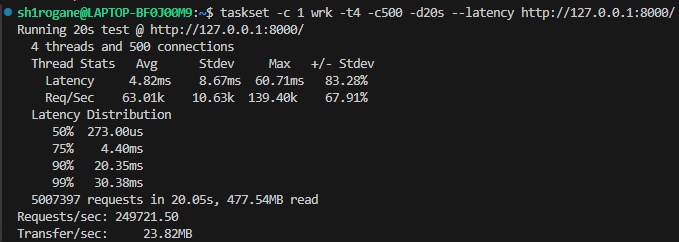
  > *压测数据*
  - 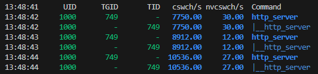
  > *服务端pidstat数据*
  - 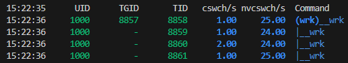
  > *客户端pidstat数据*

- **实验结果**：
  - 压测数据显示，P99 明显上升，延迟变化符合预期；
  - 因客户端线程竞激烈，客户端IO慢且间断，导致服务端主动阻塞挂起，导致服务端线程自愿切换较高，非自愿切换较低，符合预期；
  - ***客户端线程自愿切换和非自愿切换都较低，出现反直觉现象***；
  
- **反直觉现象分析**
  - 根据现有理论知识，由于线程数高于绑核数，导致存在线程被强制中断，上下文切换频繁，理应导致非自愿切换极高；
  - 但是，实验结果显示，客户端线程自愿切换较低，非自愿切换较高，说明线程被强制中断的概率较低；
  

**对此，我进行了进一步实验，依旧绑到1核，但是线程数提升至8线程：**

- **实验数据**：
  - 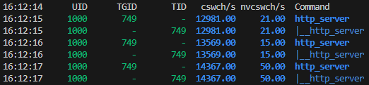
  > *1核8线程服务端pidstat数据*
  - 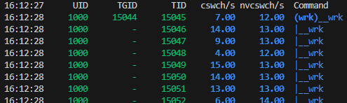
  > *1核8线程客户端pidstat数据*

- **实验结果**：
  - 服务端自愿切换提高，非自愿切换无明显变化；
  - 客户端自愿切换无明显变化，非自愿切换降低；

> 在绑定单核的前提下，提高线程数，理论上会导致客户端线程竞争更加激烈，但是实验结果再次呈现反直觉数据：非自愿切换数据直接砍半。

**对此现象，我进行了资料查阅，发现Linux内核存在调度频率机制，内核每秒钟会产生固定次数的时钟中断，**
**Linux 的 CFS（完全公平调度器）会根据频率把 1 秒钟（1000ms）平均分给线程。于是，我检查了内核的频率设置：**

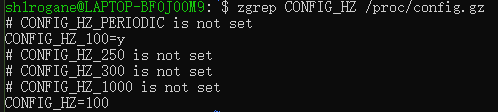

> 数据显示，CONFIG_HZ=100，即每秒钟产生 100 次时钟中断。

那么，两次实验的结果就可以合理的解释了：
  - 当单核 4 线程时，每秒100个时间片会平均分给4个线程，即 100 / 4 = 25 次/线程，平均每个线程每秒需要被强制中断25次，符合实际数据；
  - 当单核 8 线程时，每秒100个时间片会平均分给8个线程，即 100 / 8 = 12.5 次/线程，平均每个线程每秒需要被强制中断12.5次，符合实际数据；

- 对于这个现象，我发现内核调度频率机制存在权衡性缺陷：
  - 对于单核8线程的例子来说，非自愿切换频率（12.5次/秒）看似不高，但由于HZ=100导致的10ms超长切片，使得线程一旦被强制切换，就要等待极长时间（70ms）才能回到核心。
    这导致了严重的 Cache Miss，70ms足够让 L1/L2 缓存被其他线程洗刷干净，这是缓存亲和性导致的性能暴跌。
  - 当内核调度频率更高，线程被挂起持续时间会降低，可以减少 Cache Miss，提高性能。
  - 但是，内核调度频率过高，会导致线程频繁切换，仍然会在上下文切换层面增加开销，从而降低性能。
- 得出初步结论：Cache Miss = 单线程占核时长 * 线程数 * 调度频率反比
> ***并非严格呈乘法法则，实为 Cache Miss 与 单线程占核时长 线程数 调度频率反比 呈正相关关系。***

### 实验二：绑定0核（与服务器绑核冲突），4个线程，20s运行

- **预期结果**：
  - P99上升，综合延迟上升,吞吐量下降;
  - 服务端线程自愿切换较低或者不存在，非自愿切换极高;
  - 客户端线程自愿切换较高，非自愿切换较低;

- **实验数据**：
  - 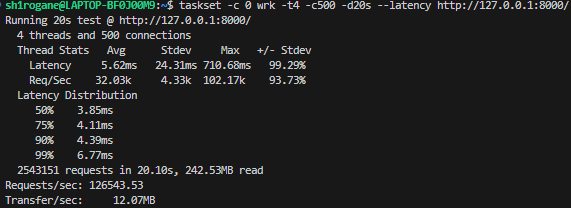
  > *压测数据*
  - 
  > *服务端pidstat数据*
  - 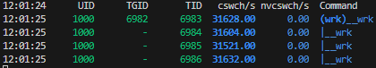
  > *客户端pidstat数据*

- **实验结果**：
  - 压测数据显示，P99 相比常态上升，延迟以及吞吐量变化符合预期；
  - 因客户端线程占据服务端线程的大部分时间片，导致服务端线程自愿切换为0，非自愿切换极高，符合预期；
  - 客户端线程需要让出时间片等待业务回返，导致自愿切换较高，非自愿切换为0，符合预期；
  
> 综合资料进一步分析时间片分配规则得出：
> - Linux 内核分配 CPU 的核心指标叫：vruntime（virtual runtime，虚拟运行时间）；
> - 服务端需要持续处理业务请求，所以 vruntime 高，优先级低，基本上会跑满调度频率限制，或者被其他线程抢占，导致不存在自愿切换；
> - 客户端需要等待服务端处理业务，发包后主动阻塞让出时间片，所以 vruntime 低，优先级高，所以非自愿切换为0；

### 实验三：绑定1-8核，4个线程，20s运行

- **预期结果**：
  - P99上升，综合延迟上升,吞吐量下降;
  - 服务端线程自愿切换较低或者不存在，非自愿切换较低或者不存在;
  - 客户端线程自愿切换较高，非自愿切换较低;

- **实验数据**：
  - 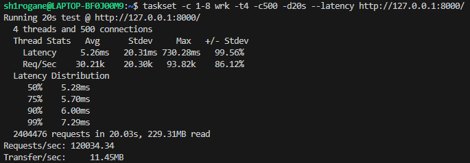
  > *压测数据*
  - 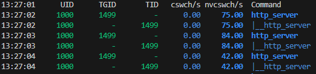
  > *服务端pidstat数据*
  - 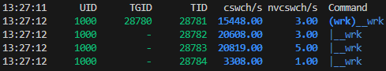
  > *客户端pidstat数据*

- **实验结果**：
  - 压测数据显示，P99 相比常态上升，延迟以及吞吐量变化符合预期；
  - 服务端满载，自愿切换为0，少量非自愿切换出现在网络软中断等环境因素，符合预期；
  - 客户端线程在多出的绑核中主动切换，导致自愿切换较高，每秒1-5次的非自愿切换来自系统噪音，符合预期；

### 实验四：绑定1-4核，4个线程，20s运行

- **预期结果**：
  - 数据最佳状态，极少线程竞争;
  - 服务端线程自愿切换较低或者不存在，非自愿切换较低或者不存在;
  - 客户端线程自愿切换较低或不存在，非自愿切换较低;

- **实验数据**：
  - 
  > *压测数据*
  - 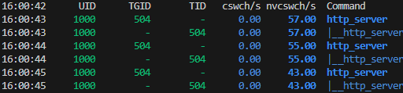
  > *服务端pidstat数据*
  - 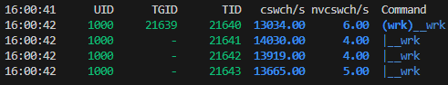
  > *客户端pidstat数据*

- **实验结果**：
  - ***出现预期偏差，延迟数据接近正常范围，但是吞吐量明显下降***；
  - 服务端满载，自愿切换为0，少量非自愿切换出现在网络软中断，符合预期；
  - ***出现预期偏差，客户端线程出现极高的自愿切换***；
  
- **反直觉现象分析**
  - 通过查找资料，发现本机CPU型号i7-11800H，八核十六线程，由于物理核内缓存资源共享，所以绑核需要避免多线程绑定同一物理核，防止Cache污染；
    - 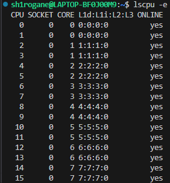
    > *i7-11800H CPU拓扑*
  - 通过查找资料，发现WSL2虚拟机内存可能残余大量的Page Cache，导致Cache亲和性不佳以及内存申请减速；
    - 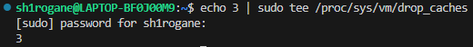
    > *清理Page Cache*
    **另外，为了长期优化架构，未来预计引入*内存池*，避免操作系统的内存分配和释放带来的性能损失。**
  
- **再次实验**
  - 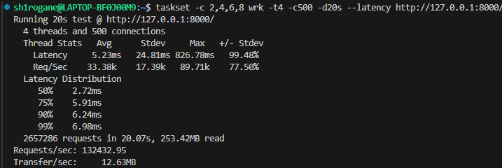
  > *压测数据*
  - 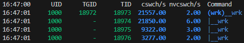
  > *客户端pidstat数据*
  在处理绑定物理核独立和Page Cache清理后，吞吐量并没有明显变化, 客户端线程**依然存在频繁地自愿切换**。

- **再次分析**
  - 物理核隔离排除了Cache亲和性问题，drop_caches排除了内存回收抖动问题。剩下的唯一变量就是客户端并发模型本身，结合资料，进行了以下归因：
  - 归因 1 ：内核自旋锁
    - 即使应用层是无锁的，但4个客户端物理核同时向同一个Socket（即逻辑核0）写入数据时，Linux 内核必须对Socket的接收队列加锁（Spinlock）。
    - 在 1:1 满载压测下，4 个强力核心的争抢导致**锁竞争**急剧上升，大量 CPU 周期消耗在“空转等锁”上。
  - 归因 2：软中断
    - 对比 实验三（绑定 1-8 核）：那里有 4 个空闲核心，内核可以将网卡软中断调度到空闲核上，避免软中断占用线程时间片。
    - 回看 实验四（绑定 1-4 核）：所有核心都被 wrk 占满。内核为了处理网络包，必须在这些忙碌的核心上强行插入软中断逻辑，导致线程被频繁打断。
  - 归因 3：跨核同步
    - 服务器在 Core 0，wrk 客户端在Core 1-4。每次数据传输都需要触发核间中断和 Cache 一致性同步（MESI协议）。这种物理距离带来的微秒级延迟，在高频 IO 下被放大，导致客户端频繁因为等待回包而陷入自愿睡眠。
  
- **意外发现**
  - 对于本机和当前环境，发现当压测客户端设置为 *“绑定 2 个逻辑核，3 线程”* 以及 *“绑定 3 个逻辑核，4 线程”* 时，压测数据以及客户端服务端pidstat数据都较为理想。
  - 绑定 2 个逻辑核，3 线程数据：
    - 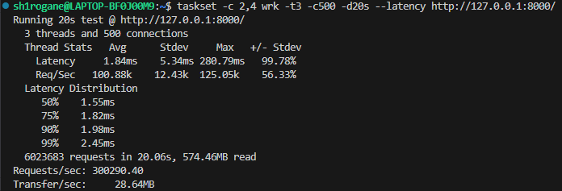
    > *压测数据*
    - 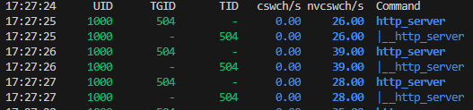
    > *服务端pidstat数据*
    - 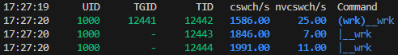
    > *客户端pidstat数据*
    **QPS 趋近于峰值，P99以及综合延迟下降，客户端线程自愿切换下降。**
  - 对于其他**“线程数略微高于绑核数的情景，数据极其相似”**；
  
- **综合资料原因分析**
  - 流水线填料效应
    - 线程数和绑核数 1:1 对齐时，线程因微小的IO等待暂停会导致核心空转；而线程高于绑核的微过载配置 允许就绪线程立刻补位，消除了 CPU 流水线的“真空期”，最大化效率。 
  - 内核软中断开销
    - 1:1 绑定导致用户态线程 100% 霸占核心，迫使内核处理网卡软中断时必须进行高开销的暴力抢核；而微过载产生的自然线程切换，为内核处理协议栈逻辑提供了低开销的调度间隙。

### 返璞归真----实验五：绑定1核，1个线程，20s运行

- **预期结果**：
  - 无线程竞争，数据处于极度理想环境;
  - 服务端线程自愿切换适中，非自愿切换较低或者不存在;
  - 客户端线程自愿切换较低或不存在，非自愿切换较低或不存在;
  
**实验数据**：
  - 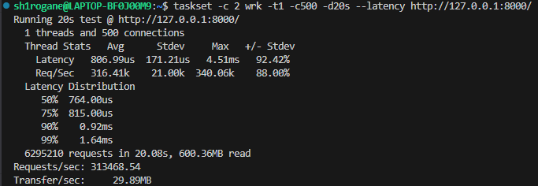
  > *压测数据*
  - 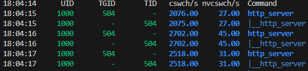
  > *服务端pidstat数据*
  - 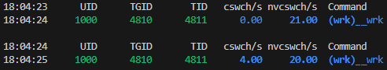
  > *客户端pidstat数据*
  - 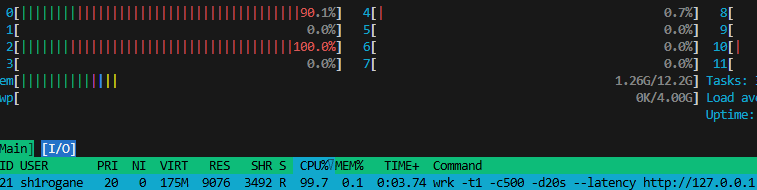
  > *htop数据*

- **实验结果**：
  - 压测数据显示，各数据均处于极度理想状态，符合预期；
  - 服务端线程未满载，存在一定的自愿切换，少量非自愿切换出现在网络软中断等环境因素，符合预期；
  - 客户端线程切换极低，属于环境噪声等因素影响范围，符合预期；
  - ***htop数据显示，服务器所在核（0核）占用率未满，在90%上下波动，而压测客户端所在核（2核）满占用率。***
  
> *单核单线程 313k QPS。在此吞吐量下CPU仍有10%盈余，性能瓶颈已从用户态转移至Linux内核协议栈的单 Socket 锁竞争。*

## 最终总结与架构启示

通过这次从“数据腰斩”到“返璞归真”的一系列探究，我深刻体会到了**代码性能、内核调度与硬件架构**三者之间复杂的博弈关系。
以下是我对本次压测实验的最终总结：

### 1. 代码“超越”内核：
在实验五中，Server 单核吞吐量达到了 **313k QPS**，但此时 CPU 占用率却只有 **90%** 左右。
这说明：**用户态代码逻辑并非瓶颈**。
在应用层优化后，瓶颈已经转移到了内核态的 **软中断**、**上下文切换** 以及 **Socket接收队列的自旋锁** 上。

### 2. 绑核悖论：
在我的WSL2环境下，**“4线程跑3核”竟然比“4线程跑4核（1:1对齐）”表现更好**。经过分析，总结出两点原因：
**流水线填料**：适度的线程“微过载”，恰好填补了系统调用带来的微秒级 IO 等待空隙。
**内核软中断**：严格的 1:1 绑定导致用户态线程 100% 霸占核心，内核为了处理网卡软中断进行高开销的暴力抢核。保留一点调度间隙，能让协议栈处理得更顺畅。

### 3. 调度延迟：
实验初期QPS暴跌的根源，最终被锁定在 **内核调度频率 (CONFIG_HZ=100)** 上。
在低频调度下，一旦发生线程轮转，回归周期长达 **70ms**。这就导致L1/L2 Cache在等待期间被彻底洗刷，直接影响性能。
