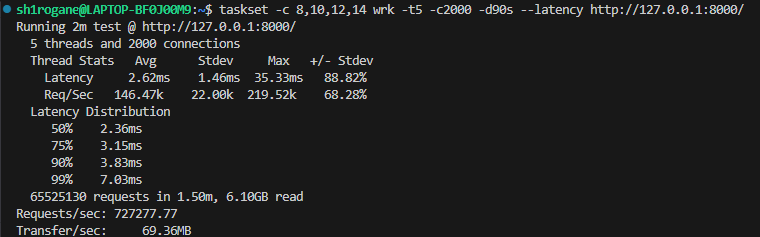
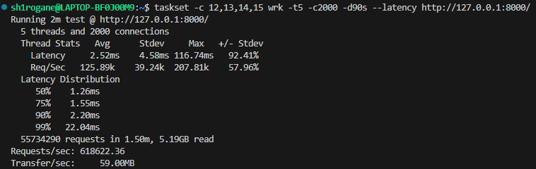
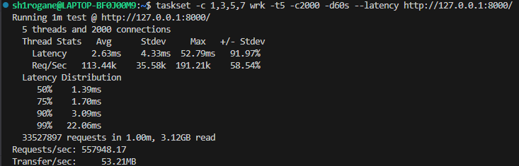
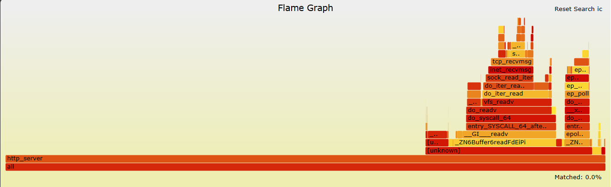
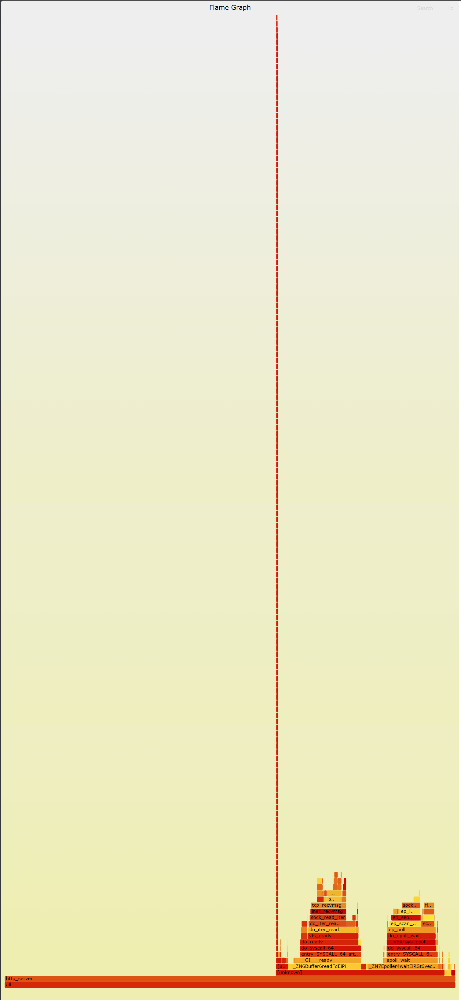
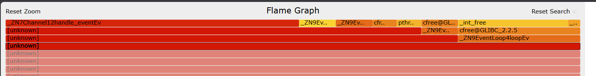
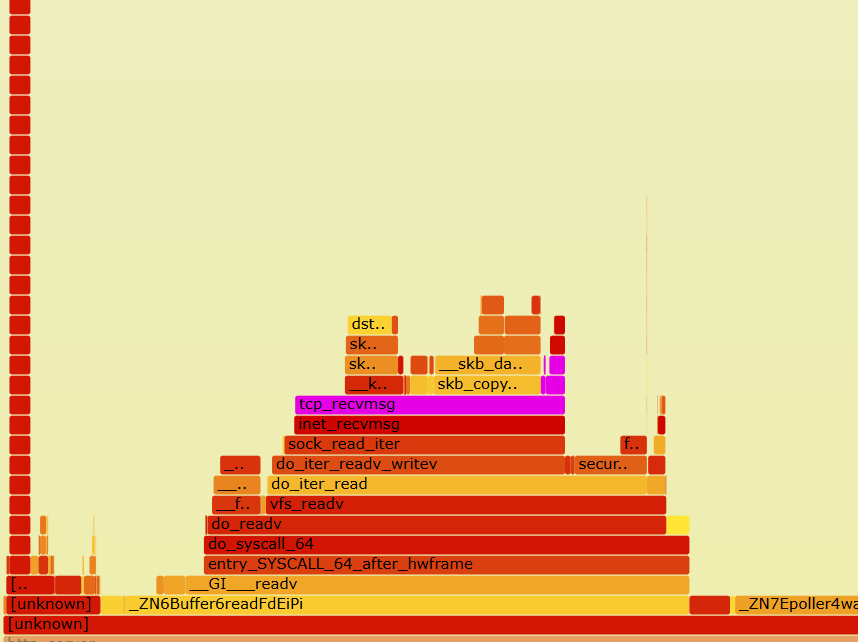
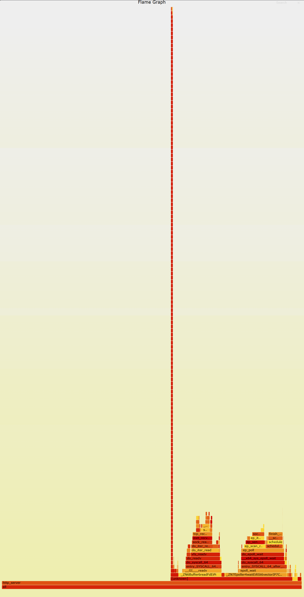
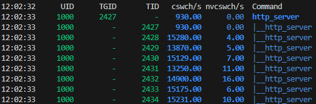

# 04_异常的并行红利：解析主从多线程 Reactor 的性能坍塌与“一柱擎天”深栈问题

## 背景

经过前面对单线程服务器的一些瓶颈分析后，我意识到需要引入多线程架构，从而压榨多核CPU的性能。

- 当前基线：单线程Reactor，300k QPS
- 目标：引入 Muti-thread 架构，期望实现 QPS 线性增长

## 问题

在实现主从 Reactor 架构，并且解决一系列段错误问题后，我进行了数据压测：

- 四线程（1 主，3 从）：
  
  - QPS：727k, P99: 7.03ms。
  - QPS 提升约 142 %，在计入锁竞争等损耗的影响下，QPS 处于预期范围内，基本认同符合非严格线性增长。
  - P99 对比单线程出现上升，不符合预期。
- 六线程（1 主，5 从）：
  
  - QPS：619k, P99: 22.04ms.
  - QPS 相较四线程出现下降，不符合与线程数呈正线性关系的预期。
  - P99 大幅上升，不符合预期。
- 八线程（1 主，7 从）：
  
  - QPS：558k, P99: 22.06ms.
  - QPS 相较六线程继续下降，确定出现了线程数与吞吐量呈反相关的现象，不符合预期。

## 分析

对于当前现象，我使用perf以及Flame Graph工具进行了分析：

### **四线程采样数据火焰图**：
  
- 分析：
  - 出现大量待机空缺，推测为主线程分发能力触及瓶颈，导致分发不均或者“不满”。
  - 搜索 “mutex”，“thread” 以及 “malloc/free” 关键字，发现查找不到 mutex 关键字，malloc & free 关键字占有 1.7% ，thread 关键字占有 1.2% 。
  - 猜测**随着线程数增多，epoll_wait 调用栈占用率增加**，当前 epoll_wait 调用栈占用率为 4.2% 。

### **六线程采样数据火焰图**：
  
- 分析：
  - mutex 关键字占有 0.4% ，thread 关键字占有 1.4%， malloc & free 关键字占有 3.1% 。
  - **epoll_wait 调用栈占用率为 11.6%**，相较于四线程增加, 初步判断为**主线程分发能力瓶颈**，导致从线程饥饿。
  - **出现极深的调用栈**。

  - *极深调用栈栈顶*

  - *栈底分支部分*

关于这个极深调用栈，我进行了观察和猜测：
- 中部 bufferReadFd 路径存在，从线程部分工作正常，QPS 的异常下降说明存在存在部分时间没有处理业务。
- 栈顶存在依次递进的 _int_free/cfree 函数，结合栈深度猜测，深度调用内核态函数导致连接超时或者其他异常，从而出现客户端对象(TcpConnection->Channel->Buffer链路)的析构，
  同时对应了长尾延迟或者最大延迟毛刺的出现。
- 结合资料查询以及数据分析，初步判断为：
  - **主线程 Acceptor 饱和，导致软中断不能拿到主核时间片，内核将软中断过载压力分配到从线程核，即“ 中断劫持 ”，引发复杂长链路调用，出现极深调用栈，以及超时连接的析构**。 
  - 当前主从架构在**短连接小包**环境下，**分发开销**超过了**业务处理开销**。
- 预计八线程采样数据火焰图可能出现现象：
  - **epoll_wait 调用栈占用率进一步增加**。
  - **依然存在极深调用栈，且栈顶存在 _int_free/cfree 函数**。

### **八线程采样数据火焰图**：
  
- 分析：
  - mutex 关键字占有 0.9% ，thread 关键字占有 1.5%， malloc & free 关键字占有 3.3% 。
  - **epoll_wait 调用栈占用率为 15.72%**，相较于六线程数据**进一步增加**, **基本确定**为**主线程分发能力瓶颈**，导致从线程饥饿。
  - **依旧存在极深的调用栈**，且栈顶存在 _int_free/cfree 函数，栈 “宽度” 增加。
  
- 另外，捕捉到八线程主从架构压测时的 pidstat 数据：
  
  - 发现从线程 cswch/s 极高，进一步证明从线程长期 “饥饿”，频繁进入休眠状态（epoll_wait）。

## 总结

| 配置 | 吞吐量 (QPS) | epoll_wait 占比 | 内存/锁损耗 | 火焰图核心特征 | 诊断结论 |
| :--- | :--- | :--- | :--- | :--- | :--- |
| **四线程** | 727k | 4.2% | ~2.9% | 大面积待机空缺  | **分发器瓶颈**，主线程分发速度慢于子线程处理速度。 |
| **六线程** | 619k | 11.6% | ~4.9% | **“一柱擎天” (深层软中断栈)** | **中断劫持**，Core 0 过载，内核强制在从线程补偿协议栈。 |
| **八线程** | 558k | 15.72% | ~5.7% | 深栈“变宽”，业务逻辑被淹没 | **协调税倒挂**，分发唤醒成本 > 业务收益。 |

数据表明，在**短连接、小包、高并发**的场景下，传统的 **Main-Sub Reactor** 架构存在无法逾越的物理障碍：

- **单点瓶颈不可消除**：主线程作为唯一的 Accept 入口和分发枢纽，在百万级 QPS 的冲击下必然成为系统的短板。
- **内核调度的不对称性**：主从架构导致 Core 0 负载过重，不仅引发了跨核通信（IPI）的开销，更诱发了内核的 **软中断劫持（SoftIRQ Stealing）** 机制，导致从线程被迫处理中断，造成不可控延迟。

- **结论：**
为了突破数据瓶颈，必须**彻弃 “分发” 概念**。

下一阶段，将引入 Linux Kernel 3.9+ 的特性 **SO_REUSEPORT**，重构为 **Shared-Nothing** 的全并行架构，试图亲手拔掉火焰图中的那根“深刺”。