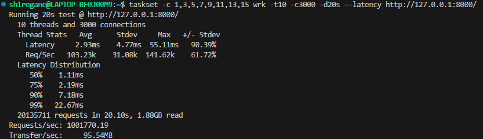
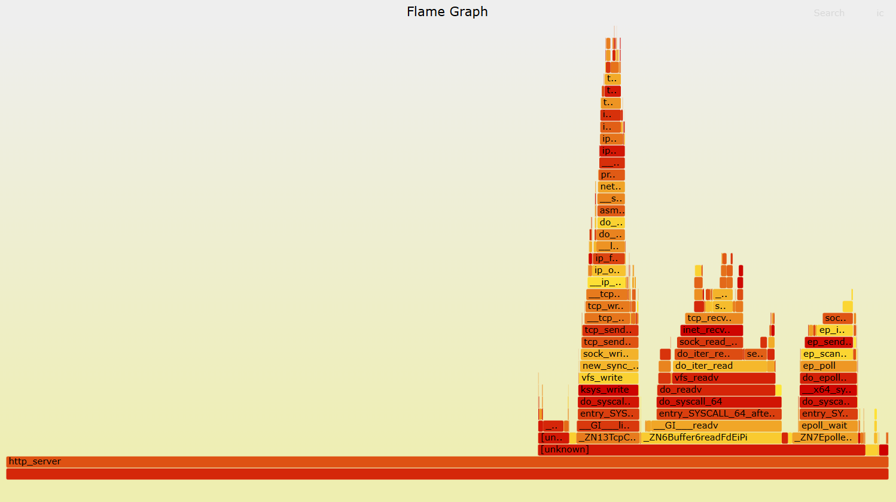
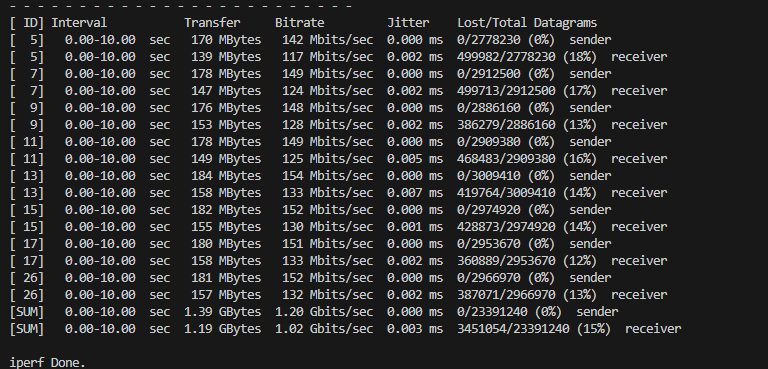
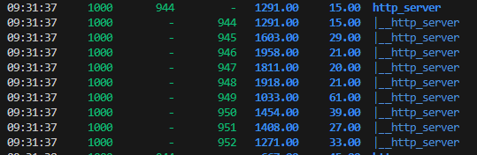
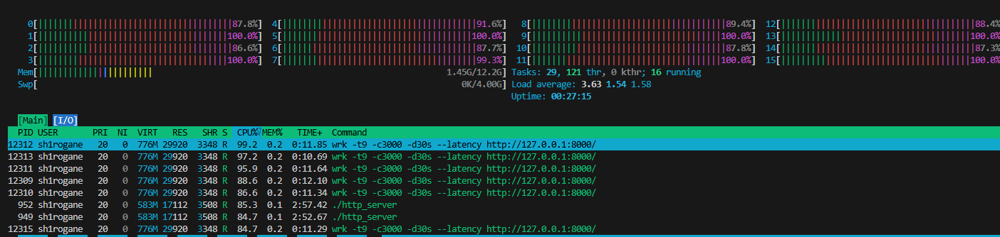
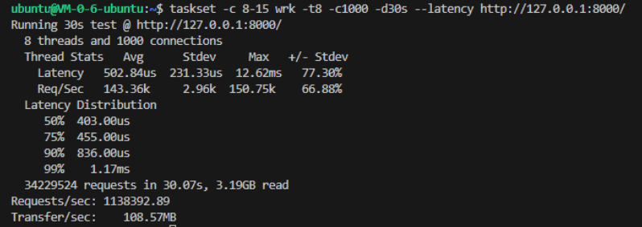
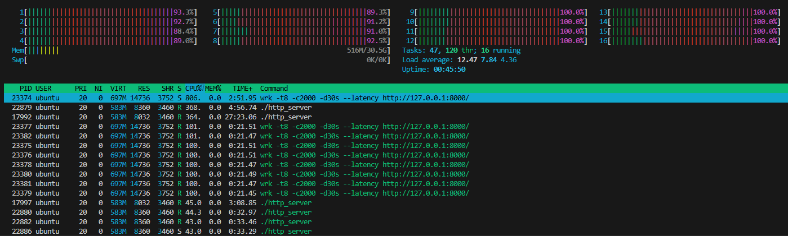

# 05_从主从分发到 Shared-Nothing —— 基于 SO_REUSEPORT 的百万级吞吐量突破

## 背景

在上一篇日志中，我验证了传统的 **Main-Sub Reactor（单 Acceptor 分发）** 架构在极高并发下的局限性。
当 服务器线程数从 4 线程调整到 6/8 线程 时，系统遭遇了严重的性能回退。火焰图与 `pidstat` 数据指出了两大元凶：
- **分发瓶颈**：主线程将连接分发给子线程涉及跨核通信和任务队列锁竞争，成本远超处理 Echo 业务本身。
- **内核串行化**：所有线程共享同一个 `listenfd` 和 Socket 接收队列，导致内核态自旋锁竞争激烈。

**思路：**
为了消除瓶颈，必须采用 **Shared-Nothing** 架构。引入 Linux 3.9+ 的 **`SO_REUSEPORT`** 特性，让每个 IO 线程拥有独立的 `Acceptor`，实现内核级的硬件负载均衡。

## 架构重构

代码层面的改动并不大，但设计思想发生了质变：
- **Before**：`Server` 持有一个 `Acceptor`，Accept 后轮询分发给 `EventLoopThreadPool`。
- **After**：`EventLoopThreadPool` 中的每个线程在启动时，初始化自己独立的 `Acceptor`，并绑定到相同的端口（8000）。

```cpp
int opt = 1;
::setsockopt(listenFd, SOL_SOCKET, SO_REUSEPORT, &opt, sizeof(opt));
```

**机制变化：**
Linux 内核通过 **TCP 四元组哈希**，将入站连接直接分流到不同的监听队列中。线程之间不再需要任何交互，彻底消除了应用层的锁和跨核唤醒开销。

## 实验数据：百万吞吐量的诞生

**测试环境：**Core 0,2,4,6,8,10,12,14 跑 Server，Core 1,3,5,7,9,11,13,15 跑 Client

### **实验：**


成功打破 8 线程下，Main-Sub Reactor 架构的性能瓶颈，另外，偶然突发性能数据突破百万：



火焰图：



- `Main-Sub Reactor` 架构的 “一柱擎天” 式调用栈消失
- `epoll_wait` 调用大幅下降
- “`mutex`” 等关键词占比极低，大多时间都用在 Linux 内核


使用 iperf3 进行压测：



测得 WSL2 回环有效 PPS 上限约为 2M，且伴随 15% 的内核丢包。
HTTP Server **实际产出 PPS 约为 1.8-2.0 M**。

考虑到性能波动，**基本说明代码性能已经达到了 WSL2 环境极限的 90% - 98%**。 


另外，采样到 `pidstat` 和 `htop` 数据：
- `pidstat` 数据：



- `htop` 数据：



pidstat 和 htop 数据说明，服务器端在压测过程中并未满载，压测客户端跑满 100% ，**服务端线程自愿切换高于常态**，进一步说明服务端线程处于 **“饥饿”** 状态，导致线程频繁在 `epoll_wait` 阻塞。

另外，注意到 P99 极高，而且 8 服务器线程，8 压测线程在本机 8 物理核 ，2 超线程的硬件条件下，存在严重的 Cache 污染。
为了看到真正 “纯净” 的数据，我决定租用云服务器。

## 云服务器跨机测试

遗憾的是，高 PPS 的云服务器限制仅能租用一台，退求其次只能租用两台较低 PPS 的服务器进行跨机测试：

**规格：**
- SA9.2XLARGE16，八核，16G，3.4GHz，AMD EPYC Turin-D(-/3.4GHz)，3Gbps，70wPPS

**测试结果：**


QPS 因 PPS 限制下降，且延迟数据依然极高。
延迟数据由于网卡PPS上限限制，出现流量拥塞和队列排队，导致延迟显著增加，尾部延迟明显恶化。

74w QPS 应对应 `74w * 2次包传递/业务请求 = 148w PPS`。

经查阅资料，猜测 70w PPS 是单向极限，出入向分配额皆为 70w PPS，考虑到性能波动，基本判断服务器跑满限制。

## 云服务器本机回环测试

需要 16 核云服务器进行测试，Core 0-7 跑 Server，Core 8-15 跑 Client

**规格：**
- C6.4XLARGE32，16核，32G，3.2GHz，Intel Ice Lake(3.2GHz/3.5GHz)，18Gbps，330wPPS

**测试结果：**



在环境限制稍小的云服务器上，QPS 达到 113w，延迟数据大幅降低。

`htop` 数据：



服务器所在核依然未满载，且用户态占比仅约为 16% - 20%，大多消耗依然位于内核态。

## 结论

- 性能结果
  - 在 16 核云服务器本地回环测试中，突破 113w QPS。
  - 云服务器本机回环下，P99 延迟稳定在 1.17ms，平均延迟 502us。
  - 跨机测试： 在 70w PPS 限速环境下，跑出 74.3w QPS，**实证代码逻辑已完全覆盖物理链路配额**。

- 架构演进
  - `Shared-Nothing` ： 舍弃 `Main-Sub Reactor` 的单 `Acceptor` 分发模式，将 Accept 权限下放至各 IO 线程。**消灭了主线程分发过载的瓶颈与跨核 eventfd 唤醒损耗**。 
  - 负载均衡： 引入 `SO_REUSEPORT` 特性，利用 Linux 内核四元组哈希算法实现线程间实现零通信。

- 性能诊断与瓶颈定性 
  - 通过 `iperf3` 建立标尺，确认了当前 WSL2 环境以及云服务器 PPS 限制。实测 QPS 与 PPS 限制高度拟合，确认瓶颈已从应用层下沉至虚拟化网卡层。 
  - `htop` 比例分析，用户态逻辑仅占约 16% - 20% CPU 份额。在 `Shared-Nothing` 架构消除应用层锁竞争后，系统剩余开销完全由 系统调用 上下文切换 与 软中断 占据。
  - 通过 `pidstat` 监控到 自愿上下文切换 远超 非自愿切换 ，确定服务器处于 “饥饿” 状态，瓶颈点在于 wrk 压测端的极限而非服务端处理能力。