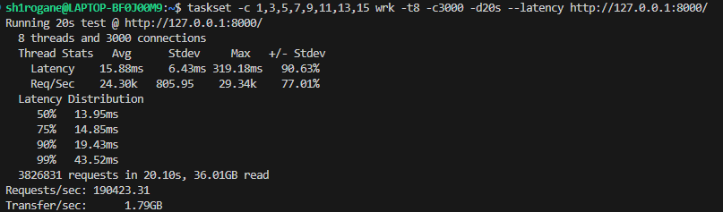
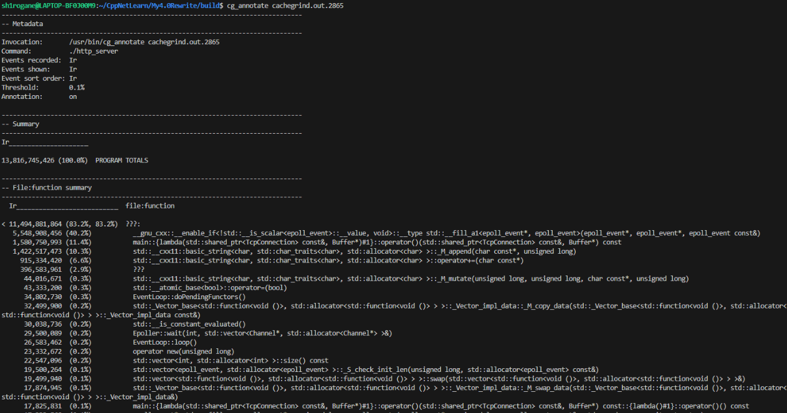
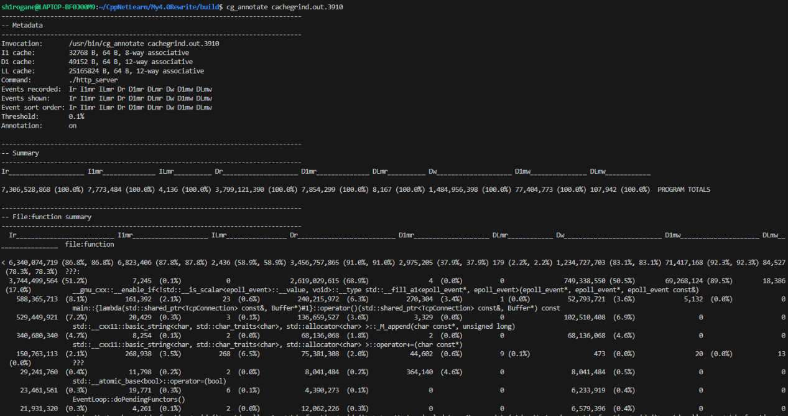
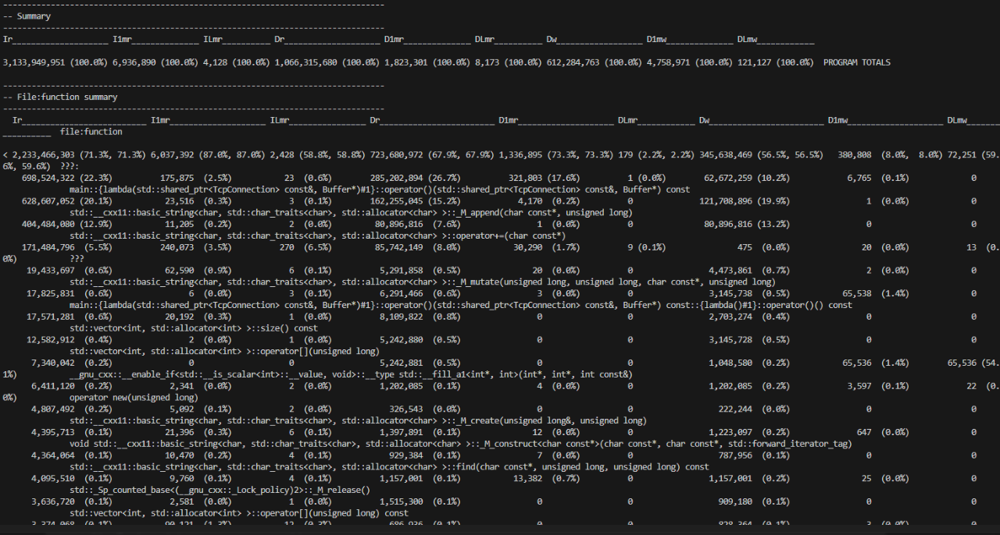

# 06_从 Cachegrind 揪出吞吐量隐藏瓶颈——epoll_event 构造引发的 L1 缓存污染 & 业务模拟 L2 击穿推演

## 背景

在完成了架构升级以及一系列调优后，我意识到当前压测场景几乎完全基于小包回声，用户态占比极低，因此需要对业务进行模拟，以更好地理解业务场景下的性能瓶颈。

为了让后续的 Valgrind Cachegrind 采样具有真实的业务指导价值，我在框架的 MessageCallback 中专门设计了一套**“高仿真业务负载”**，精准打击 CPU 的各项硬件机制：

```cpp
server.setMessageCallback([](const std::shared_ptr<TcpConnection>& conn, Buffer* buf) {
    // 1. 上下文与粘包处理
    if (!conn->hasContext()) conn->setContext(std::string());
    std::string* requestData = std::any_cast<std::string>(conn->getMutableContext());
    requestData->append(buf->retrieveAllAsString());

    if (requestData->find("\r\n\r\n") != std::string::npos) {
        
        // 仿真场景 1：撑爆 L2 Cache，模拟全局 Session 字典
        // 构造 1M 个 int（约 4MB），远超 i7-11800H 的 1.25MB L2 缓存容量。
        // 强迫 CPU 发生 L2 Eviction（换出），去 L3 甚至主存寻址。
        static const std::vector<int> big_session_table =[](){
            std::vector<int> v(1024 * 1024); 
            for(size_t i = 0; i < v.size(); ++i) v[i] = static_cast<int>(i ^ 0xDEADBEEF);
            return v;
        }();

        // 仿真场景 2：击穿 SSO (短字符串优化)，强迫堆内存分配
        // 模拟真实业务对象的构建。故意将字符串 reserve 到 128 字节，
        // 避开 C++ std::string 的 SSO 机制，强制触发 malloc/new，产生堆内存碎片与分配开销。
        std::string business_trace_id = "TRACE_ID_LONG_PREFIX_FOR_ALLOCATION_TEST_"; 
        business_trace_id.reserve(128); 
        business_trace_id += "NODE_001_";
        size_t ua_pos = requestData->find("User-Agent:");
        if (ua_pos != std::string::npos) {
            business_trace_id += requestData->substr(ua_pos, 32); 
        }

        // 仿真场景 3：破坏 CPU 硬件预取器 (Hardware Prefetcher)
        // 顺序访问内存会被 CPU 预取器掩盖延迟。这里使用 LCG（线性同余）生成伪随机数，
        // 在 4MB 的 table 中进行 15 次完全随机的内存跳跃访问，产生真实的 Pipeline Stall（流水线停顿）。
        int lookup_sum = 0;
        uint32_t seed = static_cast<uint32_t>(requestData->size() + reinterpret_cast<uintptr_t>(conn.get()));
        for (int i = 0; i < 15; ++i) {
            seed = (seed * 1103515245 + 12345) & 0x7fffffff;
            lookup_sum += big_session_table[seed % big_session_table.size()];
        }

        // 仿真场景 4：模拟中度 CPU 计算 (Protobuf 解码/规则校验)
        // 2000 次 FNV-1a 风格的哈希迭代，大约消耗 10-20μs 的计算负载。
        uint64_t hash_val = 0xCBF29CE484222325ULL;
        for (int i = 0; i < 2000; ++i) {
            hash_val ^= (uint64_t)lookup_sum + i;
            hash_val *= 0x100000001B3ULL; 
        }
        volatile uint64_t sink = hash_val + business_trace_id.size(); // 阻止编译器激进优化 (DCE)
        (void)sink;

        // 仿真场景 5：模拟长报文拼接响应
        // 故意使用循环 += 拼接大体量 Body，模拟深拷贝与系统调用的写出开销。
        std::string body = "Hello World";
        for(size_t i = 0; i < 1000; ++i) body += "0123456789";
        std::string response = "HTTP/1.1 200 OK\r\nContent-Length: " + std::to_string(body.size()) + "\r\n\r\n" + body;     

        conn->send(response);
        requestData->clear();
    }
});
```
在这种模拟真实重载 游戏/Web 服务的测试用例下，程序的性能瓶颈将简单的网络吞吐转移到了 CPU 流水线、缓存命中率与内存分配器。

根据现有架构理论，我假设：
- 添加大量业务模拟逻辑，QPS & 延迟数据大幅下降。
- 在 Reactor 模式的高频事件循环中，系统的主要开销应集中在 `epoll_wait` 系统调用、网络协议解析或业务逻辑的内存拷贝上。
- 在涉及 4MB 大负载随机寻址的压测场景下，由于数据量远超 L1(32KB) 和 L2(1.25MB) 缓存容量，理应观测到严重的缓存未命中（Cache Miss）。

## 实验


> QPS & 延迟数据 大幅下降，符合预期。

为了剖析微观架构层面的性能损耗，我首先使用 Cachegrind 进行了纯指令级（Ir）的采样分析。

### 实验一：基于默认配置的 Cachegrind 指令级采样 (只记录 Ir)

- **预期结果**：
  - 热点函数（Top 1）应为业务逻辑中的回调 Lambda，或是底层的网络 I/O 读写接口。

- **实验数据**：
  - 
  > *优化前 Cachegrind 指令开销（Ir）数据*

- **实验结果**：
  - ***出现严重预期偏差！***
  - 报告显示，全程序高达 **51.2%** 的核心指令周期（Ir）全部消耗在了一个名为 `__gnu_cxx::...std::fill_a1<epoll_event*...` 的底层库函数上。
  
- **反直觉现象分析**：
  - 一个网络服务器，把一半的 CPU 算力用来做 `std::fill`（内存填充）操作，这显然是不合理的。
  - 通过追溯调用栈，我定位到了 `Epoller::wait` 函数的核心循环体：
    ```cpp
    void Epoller::wait(int timeout_ms, std::vector<Channel*>& active_channels) {
        const int MAX_EVENTS = 1024;
        std::vector<epoll_event> events(MAX_EVENTS); // 瓶颈定位
        int nfds = epoll_wait(epoll_fd_, events.data(), ...);
        // ...
    }
    ```
  - **归因：C++ 构造函数的隐式开销**。在事件循环中，每次触发 `wait` 都会重新构造一个大小为 1024 的局部 `vector`。`vector` 的默认构造不仅会分配内存，还会强制执行**值初始化（Value-initialization）**，即调用 `memset` 或 `std::fill` 将这 1024 个结构体全部填零。
  - 考虑到每秒上万次的循环频率，这种无意义的暴力清零直接榨干了 CPU 的流水线。


### 实验二：开启缓存模拟追踪 L1 污染与 L2 击穿 (附加 --cache-sim=yes)

为了验证上述“暴力清零”操作对 CPU 缓存的具体破坏程度，以及验证 4MB 负载下的 L2 缓存击穿假设，我加入了 `--cache-sim=yes` 参数进行深度观测。

- **预期结果**：
  - `std::fill` 操作会引发极高的一级缓存写入未命中（D1mw）。
  - 4MB 大小的工作集会造成显著的最后级缓存（LLC/L3）穿透。

- **实验数据**：
  - 
  > *开启 Cache-sim 后的缓存未命中分布*

- **实验结果**：
  - 数据验证了第一个猜想：`std::fill` 不仅占据了 50.5% 的数据写入总量（Dw），更引发了高达 **89.5% 的一级缓存写入缺失（D1mw）**。
  - ***关于大负载缓存击穿，出现了反常现象***：总计穿透 L1 的读请求（D1mr）高达 182 万次，但穿透最后一级缓存（DLmr）的请求仅有 8000 余次。

- **受限环境下的 L2 击穿理论推演**：
  - 由于在 WSL2 虚拟化环境下，Hyper-V 限制了硬件性能计数器，无法直接获取 `l2_rqsts.miss` 指标。但 Cachegrind 的数据完美提供了侧面推导的依据：
  - **L2 流量承压计算**：数据穿透了 L1（D1mr 极高），但被 L3 拦截（DLmr 极低）。说明 **L2+L3 的联合命中率高达：(1,823,301 - 8,173) / 1,823,301 ≈ 99.5%**。
  - **击穿逻辑闭环**：由于 i7-11800H 单核 L2 容量仅为 1.25MB，而压测工作集高达 4MB。由于 L3（24MB）成功接住了底层流量，这意味着海量的数据流转（180万次）全部积压在 L2 与 L3 之间。**巨大的体积差导致 L2 处于疯狂的换入换出（Eviction）状态，这证实了 L2 击穿是当前大负载场景下的核心物理瓶颈。**
  - **缓存污染（Cache Pollution）**：结合 D1mw 数据，`std::fill` 的暴力清零不仅浪费算力，更致命的是它把 L1/L2 缓存中原本“温热”的业务数据全部冲刷干净，导致真正的业务处理时频频遭遇 Cache Miss。


### 实验三：实施内存复用重构与效果验证

针对定位到的代码缺陷，我重构了 `Epoller` 类。将局部变量 `events` 提取为类成员变量，利用初始化列表在构造函数中仅执行一次内存分配与初始化，彻底剥离了高频事件循环中的清零开销。

- **实验数据**：
  - 
  > *优化后的 Cachegrind 汇总报告*

- **实验结果**：
  - 性能数据呈现出跨越式提升，表现极其惊艳：
    1. **指令周期暴降**：总指令数 (Ir) 从 **73亿** 暴降至 **31亿**，直接砍掉了 **57%** 的 CPU 无效开销。
    2. **缓存污染消除**：一级缓存写入缺失 (D1mw) 从 **7700万** 骤降至 **470万**，降幅达 **94%**。
    3. **业务逻辑上位**：`std::fill` 从热点榜单中彻底消失，真正的业务逻辑（Lambda回调与 `std::string` 拼接操作）浮出水面，占据了榜首。


## 最终总结与架构启示


### 1. 警惕语言细节
在追求极致性能的 Server 引擎中，C++ `std::vector` 的自动初始化机制可能成为致命陷阱。对于 `epoll_wait` 这类内核会直接覆盖内存的系统调用，应用层的预清零是彻底的画蛇添足。

### 2. 缓存污染
`std::fill` 带来的真正瓶颈在于 89.5% 的 L1 Cache Write Miss。迫使后续真正的业务逻辑去极慢的主存（或L3）中拉取数据，是性能出现瓶颈的根本原因。

### 3. 受限环境下的推演
面对 WSL2 无法获取 L2 硬件指标的困境，不能仅停留在“无法测量”的阶段。利用 `(D1mr - DLmr)` 的流量差值，可以精准地从逻辑和数据两端交叉验证缓存击穿的发生。
