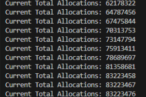
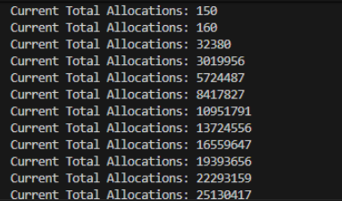
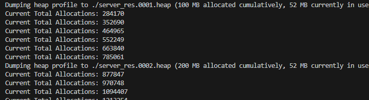
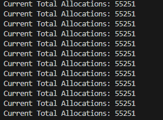

# 07_内核零分配：基于 Heap Profiling 消除 8000 万次微观内存分配的实战演进

## 1. 背景

在分析底层 `epoll_event` 构造带来的 L1 缓存污染问题 以及 L2 缓存击穿的业务仿真验证期间，我见证到了真实业务模拟带来的 “用户态占用飙升” 的现象。

既然业务开销很难避免，那就需要在引擎层面尽可能压榨内核开销，实现 高性能，高可用 的底层工具。

根据现代高性能网络库的设计理论，在 IO 密集型的高频事件循环中，**堆内存分配器（malloc/free）的底层锁竞争以及引发的 Cache Miss** 极有可能是压榨 CPU 流水线的瓶颈。

为了获取最真实的分配数据，我采用了一种简单粗暴但精准的手段：**重写全局 `operator new`，并注入原子计数器。**

```cpp
std::atomic<size_t> g_alloc_count{0};
void* operator new(size_t size) {
    // 使用 relaxed 内存序, 保证原子性的同时，尽可能降低数据同步开销
    g_alloc_count.fetch_add(1, std::memory_order_relaxed);
    return malloc(size);
}
```

开启压测后，后台打印的数据极为惊人：

- 
> *operator new 计数器统计数据*

数据表明，压测期间系统在以**每秒 260 - 270 万次**的速度调用 `new`。对于追求性能的 Reactor 内核来说，这是灾难性的开销。

## Action One：引入 ObjectPool

面对如此庞大的分配量，第一直觉是：框架在频繁地 `new TcpConnection` ( `make_share` ) 和析构对象。

为了解决对象的频繁创建与销毁，我实现了一个基于 `std::vector` 和 `std::mutex` 的通用的 `ObjectPool`（对象池）。通过自定义 `std::shared_ptr` 的 Deleter，让断开的连接不被 `delete`，而是回收到池子中。同时在 `TcpConnection` 中加入了 `reset()` 方法，使得底层的 `Buffer` 也可以被循环利用。

再次测试：
- 
> *operator new 计数器统计数据*

**期望与现实的落差：**
本以为接入对象池后，数字会大幅下降。然而再次运行压测，**计数器依然在以每秒 250-270 万次的速度“直线飙升”**！
这或许说明：框架的性能黑洞不是宏观的大对象分配，而是潜伏在代码各处的**微观分配**。

## Action Two：tcmalloc 堆分析与业务层优化

为了看清到底是哪一行代码在疯狂申请内存，我链接了 `Google tcmalloc` 库，通过 `HEAPPROFILE` 导出堆快照，并使用 `pprof --pdf` 生成了调用树。

> 
> *第一次 tcmalloc Heap Profile*

**PDF 数据显示：**
- **`std::_Vector_base::_M_create_storage` (40.9%)**：`std::vector` 在频繁申请新空间。
- **`std::__fill_a1` (41.8%)**：申请空间后，系统在频繁填零初始化。
- **`std::basic_string::append / _M_mutate`**：高频字符串扩展。

分析后，发现最大的问题是为了模拟高负载而在 `MessageCallback` 里添加的**仿真业务逻辑**：

```cpp
// 开销 1：循环拼接字符串引发海量 malloc 与内存拷贝
std::string body = "Hello World";
for(size_t i = 0; i < 1000; ++i) body += "0123456789"; 

// 开销 2：to_string 创建临时字符串
response += "Content-Length: " + std::to_string(body.size()); 
```

**业务层优化：** 将动态拼接改为了 `static const std::string`，并通过预留 `reserve` 空间来消除扩容开销。

```cpp
// 使用 static 避免重复构建巨大的 body
static const std::string big_body = [](){
    std::string s = "Hello World";
    s.reserve(11000);
    for(size_t i = 0; i < 1000; ++i) s += "0123456789";
    return s;
}();

// 使用 reserve 避免 response 拼接时的多次分配
std::string response;
response.reserve(big_body.size() + 200); 
response += "HTTP/1.1 200 OK\r\n";
response += "Content-Type: text/plain\r\n";
response += "Content-Length: " + std::to_string(big_body.size()) + "\r\n";
response += "Connection: Keep-Alive\r\n\r\n";
response += big_body;
```
## Action Three：框架层的隐形消耗

优化完业务层后，分配数量虽然有了断崖式下跌，但每秒依然有数万次的跳动。我意识到：**必须把关注点从业务逻辑转移到框架内核上，彻底解决非业务逻辑的空间申请。**

我再次抓取了 tcmalloc 的快照：

> 
> *第二次 Heap Profile*

这张报告揭露出框架内核的三个致命缺陷：
1. **`shared_ptr` 控制块开销**：图中的 `std::_Sp_counted_base`。即使 `TcpConnection` 在对象池里是复用的，但每次 `get()` 时重新包装 `std::shared_ptr` 都会在堆上 `new` 一个 16 字节的控制块。
2. **`std::map` 红黑树节点**：`Server` 使用 `map<string, TcpConnectionPtr>` 管理连接，每次新连接都会分配树节点，并伴随 `"Conn-" + fd` 的字符串分配。
3. **`TimerQueue` 的哈希节点**：图中的 `_Hashtable`。时间轮使用了 `std::unordered_set` 存放定时任务，每次连接保活都会 `new` 一个哈希节点。

## Action Four：内核重构

针对内核痛点，我实施了全方位的彻底重构：

**Step 1：`std::vector` 替换 `std::map`**
抛弃红黑树和字符串命名，利用 Linux FD 是连续小整数的特性，在 `Server` 构造时直接 `connections_.resize(65536)`。此后所有的连接插入和查找全变成了 `O(1)` 的数组寻址。

**Step 2：优化 ObjectPool 存储闭环**
为了消除 `shared_ptr` 控制块的开销，对象池内部不再存储裸指针 `T*`，修改为直接存储 `std::shared_ptr<T>`。实现了智能指针的控制块复用。

**Step 3：时间轮降维**
将时间轮的 30 个桶从 `unordered_set` 改为 `std::vector`，并在构造函数中 `reserve(10000)`。将 `TimerEntry` 的生命周期下沉到了 `TcpConnection` 对象内部作为成员变量。
每次保活刷新，只需取出自带的 Entry 指针，`push_back` 到预留好空间的 vector 中。旧桶的 `clear()` 仅扣减引用计数，不释放内存容量。

## 成果见证：预分配与 `new` 静止

为了避免业务仿真逻辑污染对引擎架构的数据影响，我暂时改回了极简小包回显：

```cpp
server.setMessageCallback([](const std::shared_ptr<TcpConnection>& conn, Buffer* buf) {
    // 清空 Buffer，不转换成 string，避免产生临时对象
    buf->retrieveAll(); 

    // 静态变量，整个运行期间只分配一次内存
    static const std::string response = 
        "HTTP/1.1 200 OK\r\n"
        "Content-Length: 11\r\n"
        "Connection: Keep-Alive\r\n"
        "\r\n"
        "Hello World";

    conn->send(response);
});
```

重构完成后，我第三次拉取了 tcmalloc 报告：

- .png>)
> *最终Heap Profile，大量集中于预申请内存*

- 
- *operator new 计数器统计数据*

**报告分析：** 
- 系统 52.7MB 的内存踪迹中， **78.1% (41.2MB)** 全部集中在 `std::vector::reserve` 上。这意味着时间轮、连接池的内存已经在程序启动阶段一次性从操作系统申请，并在运行期间一直驻留在内存中。
- `operator new` 计数器数据增速大幅削减，从 `260 万次/秒`，降低到 `10 万次/秒` ，**降低了约 96% 的调用速率**。

**最终验证：**
为了验证内核的极致纯净度，我将业务层的回调改为了 **空业务模式**（仅执行 `buf->retrieveAll();` ），并再次启动了带有 `operator new` 计数器的服务器。

> 
> *压测期间，operator new 计数器达到 55251 后彻底冻结。*

**数据记录下了这神圣的一刻：**
- **启动与预热阶段**：随着压测流量的涌入，计数器快速爬升至 55251。来自框架在填载对象池、初次扩容 Buffer、初始化时间轮向量。
- **压测稳定阶段**：当压测稳定后，**`operator new` 的计数器完全静止。**

## 总结与展望

从 8000 万次的高频调用，到 55251 的数据冻结，这次调优不仅是 QPS 上的提升，更是底层思维的重塑：
- **隐藏的内存申请**：内存申请不只存在于显式的 `new Object()`，在 `std::to_string`、`std::make_shared` 等场景也会带来微观分配。
- **预分配意识**：运气过程中频繁地申请内存，会持续触发内核态系统调用，打断 CPU 流水线并带来大量内存分配 / 释放的开销，显著降低程序运行效率。
- **问题展开**：理论上减少 `new` 调用次数，会降低内核态占用，但是压测期间 `htop` 显示内核态占比无显著变化，未来需要进一步分析原因。