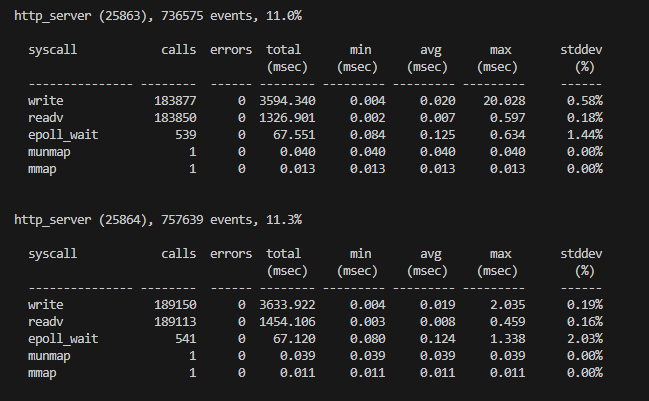
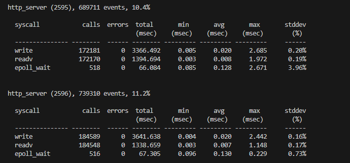
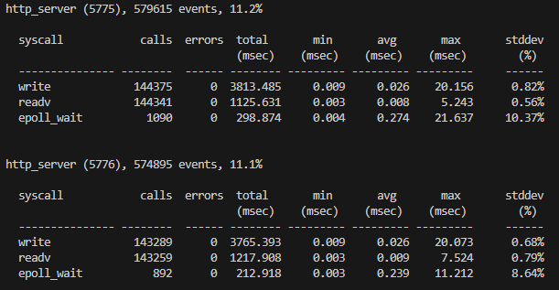
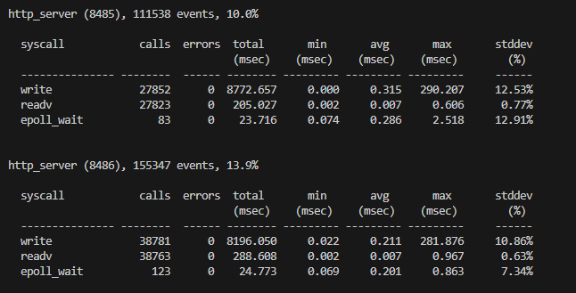
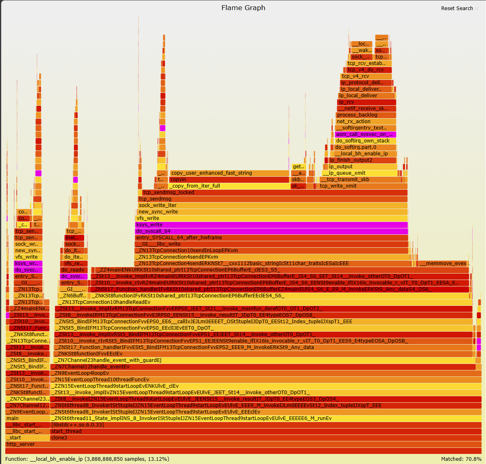
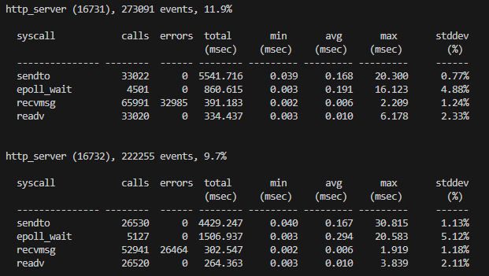
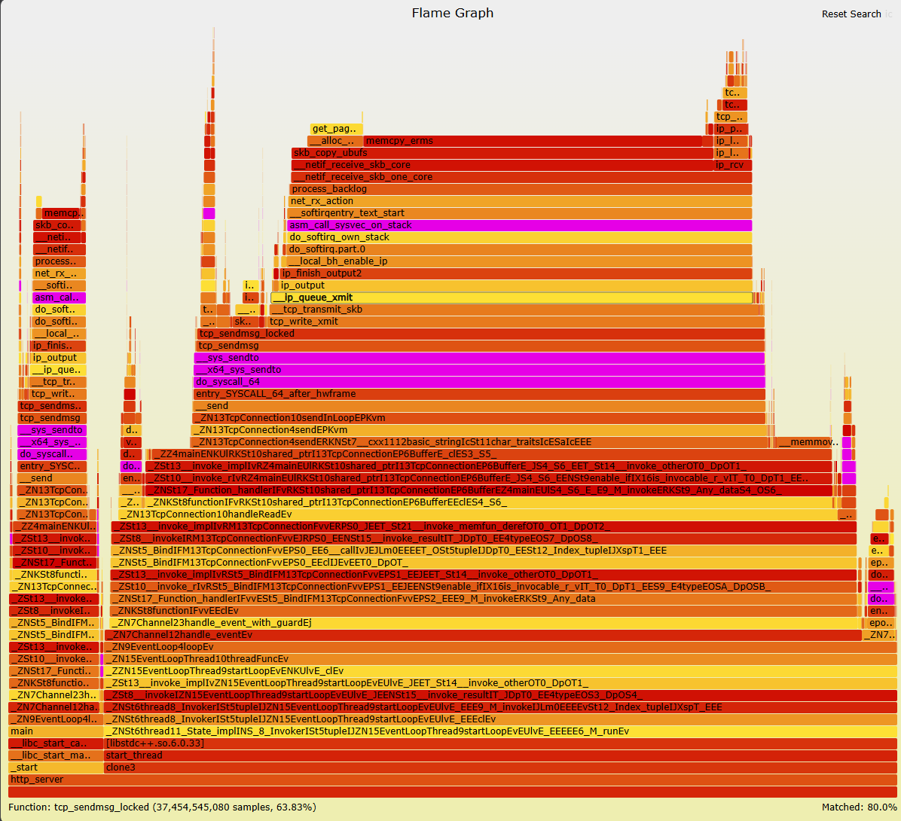
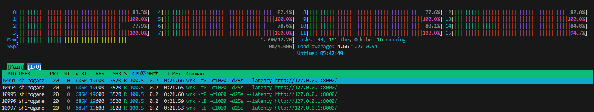

# 08_零拷贝“幻象”：基于 MSG_ZEROCOPY 的内核开销分析与虚拟网络陷阱

## 背景

在重写 `operator new` 并引入对象池，实现“运行时内存申请”完全静默后，引擎侧开销分析告一段落。
在压测时，监控工具 `htop` 显示，**在纯回显业务模式下，即使移除了频繁的空间申请，内核态占比依然高达50%以上。**

为了量化内核开销，我引入了基于内核跟踪点的动态追踪工具 **`perf trace`** 搭配 **`perf record` 采样 + 火焰图**，试图通过观测微观耗时数据。

## 基准采样与瓶颈定位

为了获取最真实的内核开销数据，我分别对 128B 16KB 64KB 256KB 的负载进行了 `perf trace` 采样。以下是抓取到的真实系统调用耗时数据：

> 
> 
> 
> 
> *各负载规格下系统调用耗时原始采样数据*

基于上述采样数据，我提取了 `write` 调用的核心指标：

| 负载大小 | `write` Avg 耗时 | `write` Max 耗时 | 性能状态分析 |
| :--- | :--- | :--- | :--- |
| **128 B** | 20 µs | ~2.0 ms | 拷贝耗时极低，开销全在陷入内核的上下文切换。 |
| **16 KB** | 20 µs | ~2.5 ms | 此时wrk压测数据显示，吞吐量已达到 **5.07 GB/s**，逼近内存带宽瓶颈。 |
| **64 KB** | 26 µs | ~20 ms | 耗时开始非线性增长。 |
| **256 KB**| **211 - 315 µs** | **~290 ms!** | 吞吐量达到 **7.53 GB/s**，内存带宽被彻底击穿，事件循环窘境。 |

**另外，为了探求数据包大小对写操作的影响，我对四种负载进行了火焰图抓取。**
`ksys_write` 的占比依次为 ： 32.12%， 34.27%， 38.41%， **57.5%**。

基本可以判断，`ksys_write` 的占比 与 负载程度呈正相关，但是在 256KB 负载下，出现阈值崩溃。
考虑到篇幅问题 以及 数据可信性，我仅展示 256KB 负载的火焰图。

> 
> *256KB 基准火焰图*

图数据表明：`ksys_write` 占据了总 CPU 时间的 **57.5%**，其中极其宽大的 `copy_user_enhanced_fast_string` 证明 **CPU 消耗大量时间，将数据从用户态 Buffer 逐字节拷贝到内核 Socket Buffer。** 

了解到当前瓶颈，查询资料，决定引入 Linux 原生的零拷贝机制：**`MSG_ZEROCOPY`**

## 接入 `MSG_ZEROCOPY` 与 64KB 数据验证

查询得知，`MSG_ZEROCOPY` 的核心原理，是让内核直接通过修改页表映射（Page Pinning）来锁定用户态内存，从而绕过 CPU 的数据搬运。

**短暂的踩坑与降级保护：**
在初步引入 `MSG_ZEROCOPY` 后，压测 QPS 竟然一度跌零。通过排查，迅速定位到了底层的工程陷阱：一是 `recvmsg` 读取内核通知队列时，未按规范挂载 `iovec` 导致 `EINVAL` 错误；二是海量并发导致内核 `optmem` 资源耗尽，触发 `ENOBUFS` 并在发送路径形成死锁。

为此，我调整了内核参数 (`optmem_max`)，并在代码中加入了**泄洪降级保护**：当内核零拷贝资源耗尽时，强制回退到传统发送，确保极限压力下不断流。

修复后，我截取了 64KB 负载下的零拷贝数据：

> 
> *图 3：64KB 零拷贝系统调用分布*

**收益与代价的权衡：**
*   **收益**：`sendto` 平均耗时从 **26 µs** 显著降至 **16 µs**。这证明在 64KB 规格下，`MSG_ZEROCOPY` 确实成功卸载了内存搬运压力。
*   **代价**：处理一个请求的系统调用成本大幅飙升。数据表明，`recvmsg` 的调用次数极高且伴随约 **50% 的错误率**。
*   **错误原因分析**：这些错误经确认均为 `EAGAIN`（无效轮询）。由于当前采用的是“每发必查”的激进策略，而内核产生零拷贝完成通知具有异步滞后性。当程序调用 `recvmsg` 频率过快时，内核尚未生成 ACK 通告，导致大量的系统调用在空转。

**结论**：这 50% 的 `recvmsg` 报错属于**管理成本溢出**。它不仅占用了 CPU 周期，还证明了：在没有实现“批量确认”逻辑前，零拷贝带来的性能红利会被这种高频的、无效的内核交互消耗殆尽。

## 256KB 火焰图与性能倒挂分析

带着 64KB 的成功经验，我对 256KB 的负载进行测试，生成的图谱却不尽人意：

> 
> *256KB 零拷贝火焰图*

这张图谱不仅宣告了 QPS 的下降，更揭露当前 **WSL2 虚拟网络环境**与零拷贝出现技术冲突的现象：

**问题一：虚假的零拷贝 (`skb_copy_ubufs`)**
在左侧发送路径中，原本期望消失的拷贝行为不仅存在，还变成了极其刺眼的 `skb_copy_ubufs`。
* **原因分析**：查询资料了解到，当前压测基于 WSL2 的 Loopback 接口。虚拟网卡并不支持真正的硬件 DMA Scatter-Gather（离散聚合）。内核在接受了我的零拷贝请求、锁定了物理页（支付了 `get_user_pages` 昂贵的管理开销）后，在发往底层网络栈时无奈地发现硬件不支持，**被迫在内核深处重新分配 skb 并执行了一次隐式拷贝.**

**问题二：软中断风暴 (`net_rx_action` 的反噬)**
图谱中右侧出现了极其高耸的软中断调用栈。
* **原因分析**：查询资料了解到， 零拷贝的异步通知机制需要内核频繁向错误队列投递完成事件。虚拟环境下的高并发导致了密集的软中断风暴，挤压用户态业务逻辑的执行时间。

**双层矛盾**
在当前的虚拟环境下，不仅带来了 `MSG_ZEROCOPY` 的页表映射、系统调用、软中断等额外开销，还未能避免传统模式的隐式拷贝瓶颈。导致极为严重的性能倒挂，反而把原本用于业务逻辑的 CPU 算力压榨殆尽。

> 
> *htop 数据*

`htop` 数据显示，在存在业务模拟逻辑时，用户态相较传统模式大幅下降，软中断占比大幅提升。

## 总结

- **零拷贝限制**：零拷贝必须依赖底层物理网卡（DMA SG）支持，且仅在拷贝开销远大于页表管理开销的**大包场景**下才会产生正向收益。
- **虚拟环境问题**：缺乏硬件条件支持的虚拟环境，并不适用所有内核优化。