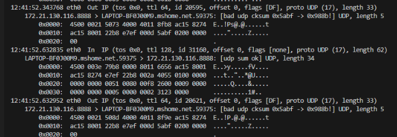
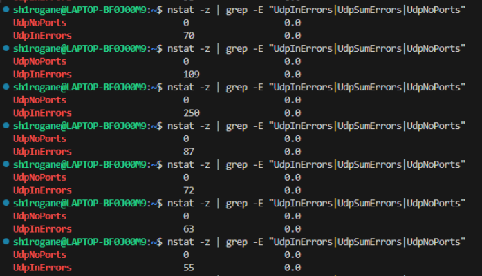
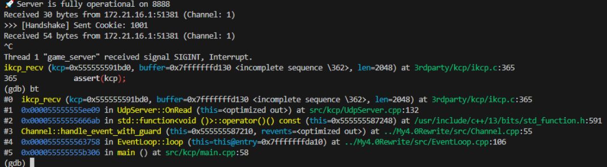
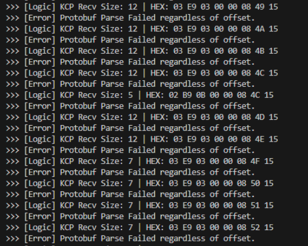

# 09_跨端通信的“至暗时刻”：WSL2 虚拟网络陷阱与多层协议逆向实战

## 背景

在进行一系列服务器底层优化后，我认为应该将底层服务器引擎投入实际的上层应用开发中。在这个过程中，我们需要考虑到跨端通信的需求。

由于我有少量游戏客户端开发经验，我选择了 Unity 作为上层业务实战模拟的平台。

当前的架构目标是实现 **Server-Authority（服务端权威）**：Unity 客户端使用 `kcp2k` 发送玩家操作指令，C++ 服务端通过 Epoll + 原生 `ikcp` 接收，并在 60Hz 的 Fixed Timestep 逻辑线程中计算权威坐标后，将 Protobuf 快照广播回客户端。

然而，在首次联调时，通信链路经历了极其惨烈的“至暗时刻”。从握手死循环，到 10 秒超时断开，再到业务数据崩溃。

为了打通这条双端物理链路，我进行了一次从内核网卡驱动、多线程锁，直到应用层协议字节的深度排障。

## UDP Checksum 与内核缓冲区溢出

起初，C++ 服务端日志显示已经成功回复了 `0x02` 握手响应包，但 Unity 客户端始终无法建立连接（`_client.connected` 始终为 false）。由于常规断点无法触达网络栈底层，我引入了 `tcpdump` 进行抓包分析。

- 
> *tcpdump 抓取到的 UDP 校验和错误报文*

**1. WSL2 镜像网络的 Checksum Bug**
抓包数据给出了致命线索：`[bad udp cksum]`。查阅内核文档后确认，这是 WSL2 镜像网络模式下网卡卸载（Offloading）的已知 Bug。系统硬件加速计算出的 Checksum 错误，导致 UDP 包刚到达 Windows 网络栈，就被内核以“数据损坏”直接丢弃。
*   **修复**：通过 `sudo ethtool -K eth0 tx off rx off` 及 PowerShell 彻底关闭网卡的 TX/RX 校验和卸载机制，强制 CPU 软件计算，网络“黑洞”被填平。

**2. 消失的 1048 字节大包与 UdpInErrors**

- 
> *nstat 监控显示内核级接收缓冲区溢出*

握手虽然通了，但当 Unity 狂按 WASD 发送 1048 字节的大型业务包时，服务端的 `recvfrom` 再次毫无反应。再次下潜到内核层，通过 `nstat -z | grep -E "UdpInErrors"` 发现，随着操作进行，内核丢包数以百计地狂飙。
*   **排查与修复**：Unity 一秒高频发送 1KB 的包，而 Linux 内核默认 UDP 缓冲区仅 212KB。由于我的 Epoll 未能瞬间排空数据，导致内核缓冲区溢出（Overflow）。我通过 `sysctl` 将内核缓冲区极限扩容至 16MB，并将 Epoll 的 `OnRead` 改造为 `while(true)` 循环，直到读取返回 `EAGAIN`，化身“抽水机”彻底榨干内核缓冲数据。

## 回环风暴、握手对齐与交叉死锁

底层网络通畅后，链路进入应用层，但接连暴露了逻辑架构上的严重冲突：

**1. 镜像模式的回环风暴（Loopback Storm）**
在镜像模式下，Windows 与 WSL 共享 IP 空间。服务端绑定 `0.0.0.0` 发出的包会被重新路由回接收缓冲区，污染 Epoll 事件流。

我在 `recvfrom` 后增加强力源端口过滤 `if (ntohs(client_addr.sin_port) == 8888) return;`，斩断自发自收现象。

**2. kcp2k 的非标握手长度与 conv 对齐**
原生 KCP 无握手逻辑，而 `kcp2k` 在外层套了探测壳。抓包显示当前版本会发送长达 30+ 字节的 MTU 探测包（包含 9 字节的 `Cookie` 等信息）。
*   **修复 A（握手镜像）**：废弃手动拼包，采用**“全盘镜像回发”**。提取客户端前 9 字节，仅翻转首字节 `0x01` 为 `0x02` 后原样发回，确保随机种子 100% 对齐。
*   **修复 B（KCP 会话对齐）**：发现 Unity 发送的可靠业务包常被 C++ KCP 状态机静默丢弃，导致 10s 后无 ACK 超时。查阅源码发现 `kcp2k` 内部强制原生 KCP 的会话 ID `conv = 0`。我立刻将服务端的初始化修正为 `ikcp_create(0, this)`，解决丢包。

**GDB 抛出死循环与交叉死锁**

- 
> *GDB 捕获 `ikcp_recv` 返回值判定错误导致的线程死循环*

在处理业务数据时，控制台彻底卡死。挂载 GDB 打印调用栈后，发现了两个极其凶险的并发 Bug：
*   **死循环**：`ikcp_recv` 无包时返回 `-1`，而 C++ 中 `while(int size = Receive(...))` 将 `-1` 判为 `true`，导致 Reactor 线程在收到第一个包后陷入无限死循环。
*   **死锁**：Reactor 线程带着“网络锁”去调 `GameWorld` 队列；而逻辑线程在 Update 时带着“世界锁”去调 `TickKcp`。两者相撞瞬间死锁。
*   **解决方案**：修正为 `while((size = Receive) > 0)`，并引入 **Lock Scoping（锁作用域最小化）**，在 Reactor 线程中拿到 Session 指针后立刻释放互斥锁，在无锁状态下进行跨层级投递，彻底消灭死锁。

## 内存偏移与 kcp2k 封包结构

所有的基础设施都跑通后，迎来了最后也是最致命的阻碍——协议解析。

**1. Channel 误解：被错当成 Header 的首字节**
为了给 Unity 回传 Snapshot，我曾根据旧版资料将首字节设为 `4` (KcpHeader.Data)。结果 Unity 瞬间崩溃，报错 `0 is not defined in KcpHeaderUnreliable`。
*   **查询得知**：在最新 `kcp2k` 中，最外层的第 1 个字节不是 KCP Header，而是 **Channel ID**（`1` 为 Reliable，`2` 为 Unreliable）。我擅自改成 `4`，导致 Unity 将其扔给了 Unreliable 频道解析，产生乱码。首字节必须永远保持为 `0x01`。

**2. “233” 报错之谜与内部 0x03 标头**
改回 Channel 1 后，Unity 再次崩溃，报错：`Receive failed to parse header: 233 is not defined`。
233 也就是 **`0xE9`**。而我手动分配的 PlayerID (1001) 的小端序正是 **`E9 03 00 00`**。

- 
> *在 C++ 端捕获的原始 16 进制流，暴露了隐藏的 0x03 字节*

*   **逆向剖析**：通过在 C++ 端打印 Hex 原始流，我发现 `E9` 前面其实隐藏了一个 `0x03` 字节。这说明 `kcp2k` 在原生 KCP 载荷内部，还套了一层私有的 Data Header (0x03)。

**3. 内存重对齐**
我重构了双端的字节流解包规范：
*   **发送端（C++）**：发送快照时，严格构建 `[0x03 (kcp2k数据头)] + [4B PlayerID] +[Protobuf]` 的包体。
*   **接收端（C#）**：双端在处理原生 KCP 载荷时，指针严格执行 `payload + 5` 的内存偏移，完美跳过传输层的所有“套娃”外壳，将纯净的字节流喂给 Protobuf 解析器。

## 总结

当最后一个 `+5` 偏移量修正完毕，按下 WASD 时，客户端的 Cube 终于实现了由 C++ 服务端权威驱动的同步。

这次排障，带来了一系列工程反思：
1. **关于并发编程**：跨模块通信时，必须尽量采用无锁队列或最小化锁作用域。
2. **协议层级隔离的重要性**：网络传输的“流外壳”与业务逻辑的“包载荷”必须有极其明确的字节边界。在跨语言通信中，可通过 Hex Dump 二进制逆向分析解析封装协议。
3. **组件补齐**：调试过程中使用了大量的日志打印，直接输出日志一方面导致程序阻塞，一方面也不便于信息整理和剖析，预计引入异步日志系统。
